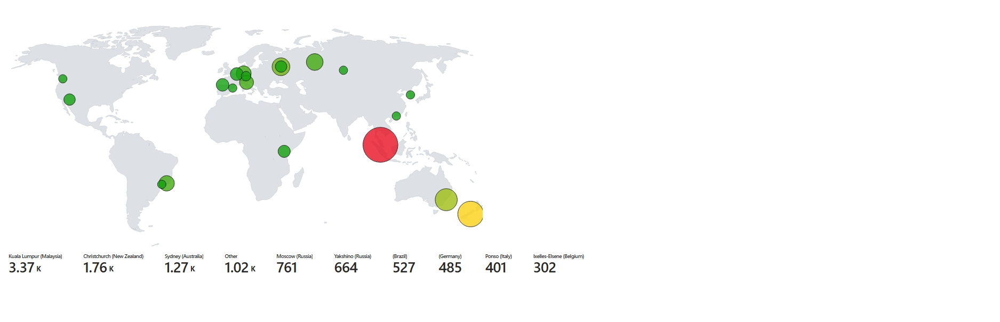

# 🛡️ SOC Analyst Home Lab – Azure Honeypot & Microsoft Sentinel  

## 📖 Overview  
This project is my hands-on **SOC Analyst home lab**, where I designed and deployed a cloud-based honeypot environment in **Microsoft Azure** and monitored it using **Microsoft Sentinel**.  

The goal was to simulate the day-to-day work of a SOC analyst by:  
1. **Deploying a honeypot VM** to attract real-world cyberattacks.  
2. **Collecting and ingesting logs** into a centralized SIEM (Sentinel).  
3. **Visualizing attacker activity in real time** on a global map.  

By setting up this environment, I was able to watch live brute-force login attempts from attackers around the world and track their geolocation data in real time.  

This project gave me both technical and analytical skills that mirror real SOC operations, from log analysis to threat visualization.  

---

## ⚙️ Lab Setup & Architecture  

### 🔹 Step 1 – Azure Resource Deployment  
- Created a **Resource Group** in Azure to organize the lab environment.  
- Deployed a **Windows 10/11 Virtual Machine (VM)** and intentionally left it vulnerable:  
  - Disabled the Windows Firewall.  
  - Allowed inbound Remote Desktop Protocol (RDP) traffic from **anywhere**.  
- This exposed the VM to the internet, making it an attractive target for attackers.  

### 🔹 Step 2 – Log Analytics & Microsoft Sentinel  
- Connected the VM to a **Log Analytics Workspace** to collect system and security logs.  
- Integrated the workspace with **Microsoft Sentinel**, Azure’s SIEM platform.  
- Configured Sentinel to ingest and analyze security logs from the honeypot.  

### 🔹 Step 3 – Real-Time Threat Collection  
- Monitored **failed RDP login attempts (Event ID 4625)** from attackers trying to brute-force the VM.  
- Extracted attacker **IP addresses** from the logs.  
- Enriched the data with **geolocation information** to determine the country and region of origin.  

### 🔹 Step 4 – Data Enrichment with Spreadsheet  
- Collected attacker IPs into a **spreadsheet (CSV format)** along with their **latitude, longitude, city, and country data**.  
- Uploaded this dataset into **Microsoft Azure**, enabling Sentinel to **map attacker IPs to real-world geographic locations**.  
- This acted almost like a “DNS for visualization,” translating raw IP addresses into meaningful real-world context.  
- The enriched dataset allowed Sentinel’s dashboard to represent where each attack originated from globally.  

### 🔹 Step 5 – Visualization in Sentinel  
- Built a **custom Sentinel Workbook** with KQL queries.  
- Plotted attacker IP addresses on a **real-time global map**.  
- Observed thousands of login attempts per hour from different regions across the world.  

---

## 📊 Skills Gained  

Through this lab, I practiced and improved the following skills:  

- **SIEM Administration**  
  - Configuring Microsoft Sentinel to collect, analyze, and visualize security logs.  
- **Kusto Query Language (KQL)**  
  - Writing queries to filter login events and extract relevant attacker data.  
- **Cloud Security**  
  - Managing Azure resources, securing (and intentionally exposing) virtual machines.  
- **Threat Hunting**  
  - Identifying malicious login attempts and mapping adversary infrastructure.  
- **Data Enrichment & Visualization**  
  - Using a spreadsheet of IPs + geolocation to create a real-world attack map.  
- **SOC Analyst Mindset**  
  - Thinking through attacker techniques and analyst response strategies.  

---

## 🖼️ Demo Screenshot  

  

---

## 🚀 Future Improvements  

This lab is just the foundation. I plan to expand it with:  

- **Incident Response (IR) Playbooks**  
  - Automating responses using Sentinel and Azure Logic Apps (e.g., auto-blocking malicious IPs).  
- **Alerting & Detection Rules**  
  - Building custom alerts for brute-force attacks and suspicious login activity.  
- **Expanded Visualization**  
  - Adding dashboards for trends, top attacker regions, and time-based analysis.  
- **Additional Honeypots**  
  - Deploying Linux honeypots alongside Windows for more diverse telemetry.  

---

## 🌍 Key Takeaways  

- Even a single exposed VM on the internet can be attacked **within minutes**.  
- Microsoft Sentinel provides powerful tools for **SOC-style monitoring and threat visualization**.  
- This lab helped me build both **technical skills (Azure, Sentinel, KQL)** and **analytical thinking** required for real-world SOC analyst roles.  
- Using a spreadsheet of IPs and geolocation data gave me experience with **data enrichment**, which is critical for turning raw logs into actionable intelligence.  
- Most importantly, it was a lot of fun watching real-world attacks unfold in real time!  

---

💡 **Summary:**  
I deployed a honeypot in Azure, ingested logs into Microsoft Sentinel, enriched attacker IPs with geolocation data via a spreadsheet, and created a real-time global attack map to simulate SOC analyst workflows. This project reinforced cloud security, SIEM, and threat-hunting skills while giving me hands-on exposure to live cyberattacks.  

